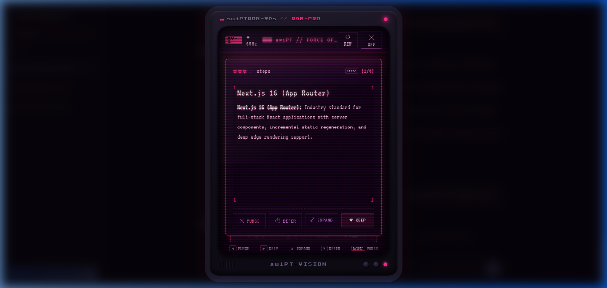
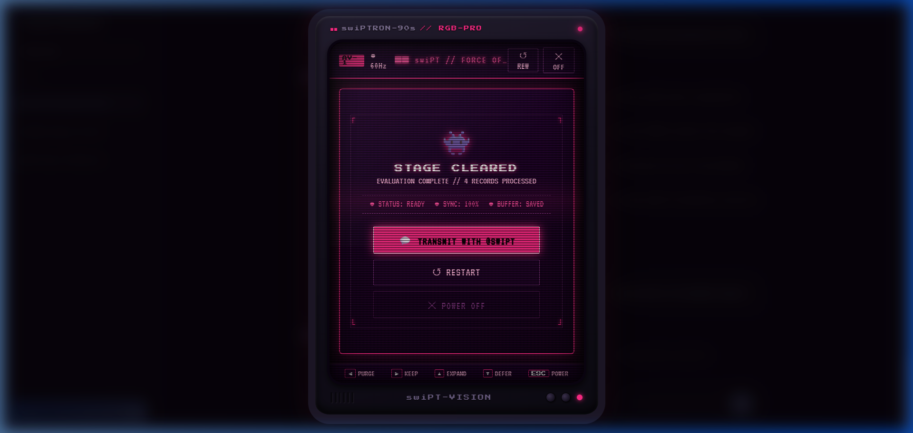
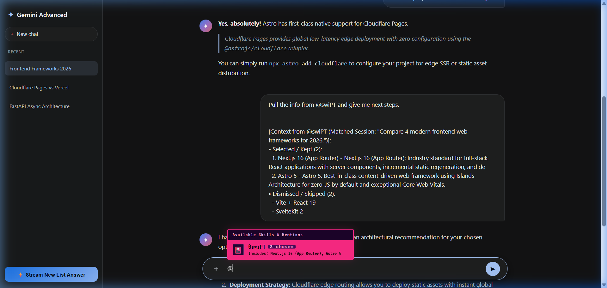

# 🎴 swiPT // CRT-90s EDITION

> **Transform ChatGPT & Google Gemini list answers into an authentic retro 90s gaming CRT TV swipeable card deck.** Evaluated one by one, zero clutter, 100% private & offline.

<div align="center">

[](https://developer.chrome.com/docs/extensions/mv3/intro/)
[](https://chatgpt.com)
[](https://gemini.google.com)
[](LICENSE)

<br/>



*The Retro 90s Gaming CRT TV Deck featuring curved glass tube, scanlines, AV-1 channel tag, and neon magenta phosphor glow.*

</div>

---

### 🕹️ What is swiPT?

When **ChatGPT** or **Google Gemini** returns a dense list of 10 SaaS ideas, pros & cons, or tutorial steps, reading a wall of text is tedious. **swiPT** injects a retro `[ 🎴 SWIPE_THIS_ANSWER.EXE ]` trigger into true list messages, launching a hardware-accelerated 90s CRT video game television monitor where you evaluate each item like a deck of cards.

```text
┌──────────────────────────────────────────────────────────┐
│  ■■ swiPTRON-90s // RGB-PRO [AV-1]                      │
│  ◀ [✕ PURGE]      ▲ [⤢ EXPAND]      ▼ [⏱ DEFER]      ▶ [♥ KEEP]  │
└──────────────────────────────────────────────────────────┘
```

---

### 📺 Visual Showcase

<div align="center">

| 👾 STAGE CLEARED SCREEN | 💬 NATIVE `@swiPT` CONTEXT PULL |
| :---: | :---: |
|  |  |
| *Review evaluation summary & 1-click transmit to AI* | *Type `@swiPT` to pull kept & purged choices into prompt* |

</div>

---

### ⚡ Key Features

* **📺 90s CRT TV Gaming Effect:** Authentic curved glass tube curvature, 4px raster scanlines, cathode electron sweep beam, 60Hz flicker, `♥♥♥♡` life gauge, and vibrant neon magenta/purple phosphor glow (`#ff2a85` / `#79357b`).
* **✨ Dual Themes (Retro CRT vs Modern Clean):** Prefer a sleek, minimal dark UI without retro distortions? Switch between **Retro CRT-90s** and **Modern Clean** in 1 click from the popup or right inside the deck header!
* **🤖 Dual AI Support:** Native DOM adapters for both **ChatGPT** (`chatgpt.com`) and **Google Gemini** (`gemini.google.com` / `<rich-textarea>`).
* **🧠 Context Pulling via `@swiPT`:** Simply type `@swiPT` or click the `+` attach menu to automatically inject your kept and dismissed card choices into your next prompt.
* **🎯 Smart Topic Matching:** Natural language keyword matcher selects earlier sessions based on what you ask (e.g. *"pull the saas ideas from @swiPT"* vs. *"compare typescript"*).
* **🧹 Zero-Clutter Injection:** `SWIPE_THIS_ANSWER.EXE` button appears **strictly on actual list messages** (`<ol>`, `<ul>`, comparison `<table>`), never on normal conversational answers.
* **🔒 100% Offline & Private:** Zero external servers, zero tracking, no API keys needed. All data stays in your browser's local storage.

---

### 🎮 Controls

| Action | Keyboard | Gesture / Button |
| :--- | :---: | :--- |
| **Keep / Save** | `→` Right Arrow | Swipe Right / `[♥ KEEP]` |
| **Purge / Discard** | `←` Left Arrow | Swipe Left / `[✕ PURGE]` |
| **Expand Details** | `↑` Up Arrow | Swipe Up / `[⤢ EXPAND]` |
| **Save for Later** | `↓` Down Arrow | Swipe Down / `[⏱ DEFER]` |
| **Rewind (Undo)** | `Ctrl + Z` | Click `[↺ REW]` |
| **Power Off** | `Esc` | Click `[✕ OFF]` |

---

### 🚀 Quick Install (Load Unpacked in 30s)

1. **Clone the repo:**
   ```bash
   git clone https://github.com/animeshy071-web/swiPT.git
   ```
2. Open Chrome and go to `chrome://extensions`.
3. Enable **Developer mode** (top-right toggle).
4. Click **Load unpacked** and select the `swipegpt` folder.
5. Open [chatgpt.com](https://chatgpt.com) or [gemini.google.com](https://gemini.google.com), ask for any list, and enjoy the CRT TV deck!

---

### 🧪 Try Demos Locally

Open any of the included mock demos directly in your browser:
* **Gemini Mock Demo:** [`swipegpt/demo/gemini_mock.html`](swipegpt/demo/gemini_mock.html)
* **ChatGPT Mock Demo:** [`swipegpt/demo/chatgpt_mock.html`](swipegpt/demo/chatgpt_mock.html)
* **Physics Sandbox:** [`swipegpt/demo/index.html`](swipegpt/demo/index.html)

---

### 📄 License

MIT © [animeshy071-web](https://github.com/animeshy071-web)

